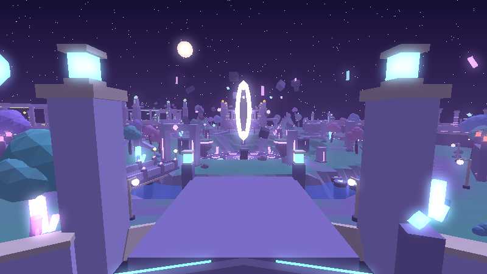
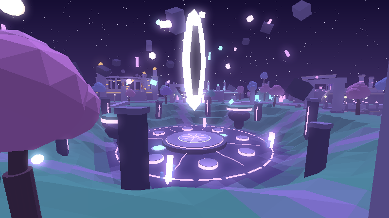
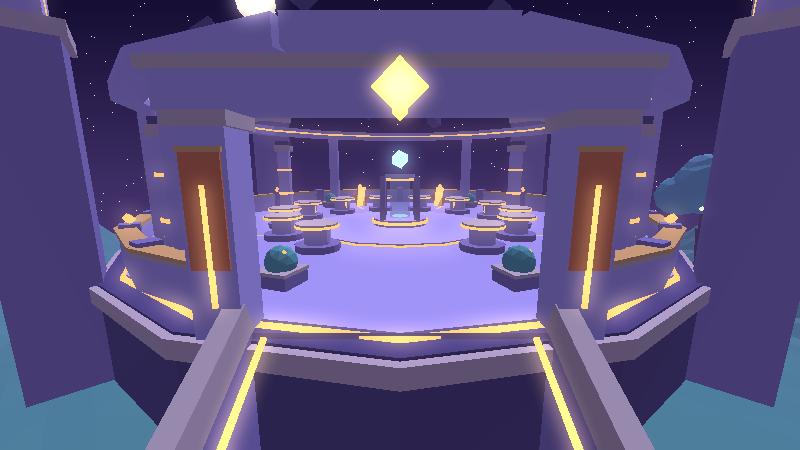

# RIFT HEIST

> *Une faille s'est ouverte au cœur de l'île. Elle crache des reliques cosmiques.
> Attrape-les, ramène-les dans ton Sanctuaire… et protège-les.*

Jeu Roblox multijoueur (6 à 8 joueurs par serveur) écrit en **Luau strict**, géré avec **Rojo**.
Tout le monde — terrain, Faille, sanctuaires, reliques, interface, effets — est généré par le code :
le projet ne dépend d'**aucun asset externe** et se lance tel quel.

| Spawn | La Faille | Sanctuaire (palier 5) |
|---|---|---|
|  |  |  |

<sub>Aperçus produits par le moteur de rendu logiciel du dépôt (`tools/render`) à partir du monde réellement
généré par le code du jeu. Le rendu dans Roblox Studio (éclairage Future, bloom, particules, beams) est plus riche.
Vue de dessus de l'île : [`docs/previews/map.png`](docs/previews/map.png).</sub>

---

## Sommaire

1. [Démarrage rapide](#1-démarrage-rapide)
2. [Principe du jeu](#2-principe-du-jeu)
3. [Installation](#3-installation)
4. [Utilisation de Rojo](#4-utilisation-de-rojo)
5. [Architecture](#5-architecture)
6. [Tester en multijoueur](#6-tester-en-multijoueur)
7. [DataStore et sauvegarde](#7-datastore-et-sauvegarde)
8. [Ajouter une relique](#8-ajouter-une-relique)
9. [Modifier l'économie](#9-modifier-léconomie)
10. [Remplacer les placeholders (sons, musique, polices)](#10-remplacer-les-placeholders)
11. [Commandes de développement](#11-commandes-de-développement-studio)
12. [Tests automatisés et outils](#12-tests-automatisés-et-outils)
13. [Sécurité / anti-exploit](#13-sécurité--anti-exploit)
14. [Performance](#14-performance)
15. [Scénarios de test manuels](#15-scénarios-de-test-manuels)

---

## 1. Démarrage rapide

1. Télécharger **`RiftHeist.rbxl`** (racine du dépôt).
2. Double-cliquer dessus → Roblox Studio s'ouvre.
3. Appuyer sur **Play** (F5). C'est tout.

Au lancement, le monde se construit côté serveur (≈ 1–2 s), l'écran de chargement disparaît, la caméra
fait un court travelling vers la Faille, et le tutoriel guide par le monde lui-même :

> « Une faille vient de s'ouvrir. » → faisceau vers la Faille → « Ramène-la à ton Sanctuaire. »
> → « Place-la sur un piédestal. » → puis l'Essence, le Noyau et les améliorations.

En Studio sans accès API, la partie est jouable avec des données temporaires (un message l'indique).

## 2. Principe du jeu

**Boucle principale** : *Faille → Relique → Transport → Sanctuaire → Essence → Améliorations → Reliques plus rares*.

- **La Faille** (centre de l'île) se charge puis **expulse** des reliques sur des plateformes autour d'elle.
  Chaque apparition est un *moment* : charge, flash, onde de choc, et pour Légendaire/Mythique/Secret une
  annonce serveur, un pilier de lumière visible de partout et un tremblement de caméra.
- **Revendiquer** : maintenir l'interaction près d'une relique. Elle flotte alors **au-dessus de toi** — tout le
  monde voit ce que tu transportes (plus elle est rare, plus tu es lent et visible).
- **Sanctuaire** : chaque joueur reçoit l'un des 8 sanctuaires disposés autour de la vallée. En y entrant, les
  reliques portées se posent **automatiquement** sur un **piédestal** libre (vol plané animé). Une relique
  identique à une relique déjà posée la **fusionne** (niveau +1, jusqu'à 5).
- **Essence** : chaque relique posée produit de l'Essence en continu dans le **Noyau** du sanctuaire
  (capacité limitée → il faut revenir le vider en marchant sur le cercle de collecte).
- **Améliorations** (bouton *Sanctuaire*) : piédestaux, palier du sanctuaire (Avant-poste → Sanctuaire →
  Temple → Citadelle → Nexus, avec reconstruction visuelle animée), Résonance (+% Essence), Foulée (vitesse),
  Harnais (porter 2 puis 3 reliques).
- **RiftDex** : collection des 19 reliques (silhouettes tant qu'elles ne sont pas découvertes) et des mutations
  découvertes. Chaque découverte déclenche une animation et donne un bonus permanent d'Essence.

### Raretés (7)

| Rareté | Poids d'apparition | Essence/s de base | Distinction visuelle (en plus de la couleur) |
|---|---|---|---|
| Commune | 56 % | 1 | lueur simple, quelques particules |
| Peu commune | 25 % | 3 | plus grande, plus lumineuse, plus de particules |
| Rare | 12 % | 8 | anneau au sol + 1 orbiteur, annonce aux joueurs proches |
| Épique | 5 % | 22 | aura + 2 orbiteurs, charge de la Faille plus longue |
| Légendaire | 1,6 % | 60 | pilier de lumière visible de loin + 3 orbiteurs, annonce serveur |
| Mythique | 0,36 % | 160 | 4 orbiteurs + onde de choc périodique |
| Secrète | 0,04 % | 450 | 5 orbiteurs + onde de choc + glitch visuel |

### Mutations (5)

Chargée ×2, Dorée ×3, Néant ×4, Corrompue ×6, Prismatique ×10 — chacune a son propre traitement visuel
(arcs électriques, matériau doré, distorsion sombre, glitch rouge, arc-en-ciel cyclique).

### Événements (4)

Toutes les 4–6 minutes : **RIFT OVERLOAD** (une relique toutes les 1,6 s au lieu de 5,5 s, mutations Chargées ×3), **VOID STORM**
(Néant ×8, ambiance tempête), **GOLDEN SURGE** (Dorées ×6, lumière dorée), **ECLIPSE** (raretés boostées,
relique exclusive *Sceau d'Éclipse*). Chaque événement change l'éclairage, l'atmosphère et la météo.

### Le vol (VOL → COURSE → POURSUITE → SÉCURISATION)

1. **Vol** : maintenir l'interaction sur une relique posée chez un autre joueur (1,2 s pour une Commune
   jusqu'à 4 s pour une Secrète). Le propriétaire reçoit une **alerte** immédiate et voit la barre de progression.
2. **Course** : le voleur porte la relique au-dessus de sa tête, surligné en rouge, et doit rejoindre **son**
   sanctuaire à pied (100 s maximum, sinon la relique rentre chez elle).
3. **Poursuite** : le propriétaire peut le **Repousser** (F) ou le rattraper avec le **Dash** (Q). Une relique
   lâchée par un voleur revient automatiquement chez son propriétaire après 12 s ; le propriétaire peut aussi la
   récupérer immédiatement.
4. **Sécurisation** : déposée dans le sanctuaire du voleur, la relique change de propriétaire.

**Équité / anti-harcèlement** :
- recharge de vol de 40 s ; max 2 vols par paire de joueurs / 10 min ; max 3 vols subis / 15 min ;
- **Égide** : 90 s d'immunité après avoir été volé ;
- **Novice** : impossible d'être volé pendant ses 8 premières minutes de jeu ;
- **Repos** : un joueur inactif (AFK > 150 s) ne peut pas être volé — l'AFK n'est jamais puni ;
- **Dernières reliques** : un sanctuaire avec moins de 3 reliques posées est intouchable ;
- **Sceau** (G) : barrière temporaire du sanctuaire (20–36 s selon le palier, recharge 110 s) qui éjecte les intrus ;
- les reliques posées et le Noyau ne sont **jamais** perdus en se déconnectant.

### Combat léger

- **Dash** (Q / R1 / bouton tactile) : élan court, recharge 3,2 s.
- **Repousser** (F / L1 / bouton tactile) : onde de choc qui repousse et étourdit 0,6 s ; un joueur touché fait
  **tomber** ce qu'il porte, puis bénéficie de 2,5 s de stabilité (pas de chaîne d'étourdissements).
- Tout est validé par le serveur (distance, recharges, état).

### Rythme visé

- 30 s : comprendre (tutoriel par le monde, faisceau, flèche de bord d'écran).
- 2 min : plusieurs reliques posées, première Essence (cadeau de bienvenue de 40 Essence au premier dépôt).
- 5 min : première amélioration visible (nouveaux piédestaux qui surgissent du sol).
- 10–15 min : objectif rare (palier 2 du sanctuaire, première Épique/Légendaire, premier événement).

### Contrôles

| Action | Clavier | Manette | Mobile |
|---|---|---|---|
| Interagir (revendiquer, voler, inspecter) | E (appui / maintien) | X | toucher / maintenir la carte |
| Dash | Q | R1 | bouton |
| Repousser | F | L1 | bouton |
| Sceller le sanctuaire | G | Y | bouton |
| Fermer un menu | Échap | B | ✕ |

## 3. Installation

### Pour jouer / tester uniquement
Roblox Studio suffit : ouvrir `RiftHeist.rbxl` (voir [Démarrage rapide](#1-démarrage-rapide)).

### Pour développer
Prérequis : Roblox Studio, [Rokit](https://github.com/rojo-rbx/rokit) (ou Aftman), Git.

```bash
git clone <ce dépôt>
cd steal-project
rokit install          # installe rojo 7.6.1, luau-lsp 1.55.0, lune 0.10.4 (voir rokit.toml)
# ou : aftman install  (aftman.toml)
```

Dans Roblox Studio, installer le **plugin Rojo** (Plugins → Manage Plugins, ou `rojo plugin install`).

## 4. Utilisation de Rojo

**Synchronisation en direct** (recommandé pendant le développement) :

```bash
rojo serve default.project.json
```

Puis dans Studio : ouvrir `RiftHeist.rbxl` (ou un baseplate vide), onglet **Rojo → Connect**.
Chaque sauvegarde d'un fichier `.luau` est répercutée instantanément dans Studio.

**Construire le fichier de place** :

```bash
rojo build default.project.json -o RiftHeist.rbxl
```

`default.project.json` configure aussi les services : `Lighting` (Future, Atmosphere, Bloom, SunRays,
ColorCorrection, DepthOfField, Sky), `StarterPlayer` (caméra, vitesse, saut), `Players` (spawn manuel par le
serveur), `Workspace` (gravité, Streaming désactivé — la carte est compacte), `Terrain` (herbe décorative).

**Publier** : ouvrir le `.rbxl` dans Studio → File → Publish to Roblox. Activer ensuite les DataStores (§7).

## 5. Architecture

```
src/
├── shared/                   → ReplicatedStorage.Shared (client + serveur)
│   ├── Config/               toutes les valeurs de design, centralisées
│   │   ├── GameConfig.luau   vitesses, temps, distances, règles de vol, économie, sauvegarde…
│   │   ├── Rarities.luau     7 raretés : poids, Essence, échelle, lumière, habillage visuel
│   │   ├── Mutations.luau    5 mutations : chance, multiplicateur, apparence
│   │   ├── Relics.luau       catalogue des 19 reliques (ordre = ordre du RiftDex)
│   │   ├── Upgrades.luau     améliorations et tables de coûts explicites
│   │   ├── Events.luau       4 événements : durée, effets, ambiance (lumière/atmosphère/météo)
│   │   ├── Sounds.luau       registre audio (id / fallback / note de design)
│   │   └── Theme.luau        couleurs, polices, rayons, couleurs des 8 sanctuaires
│   ├── Locale/               textes EN/FR (choix auto selon la langue Roblox, modifiable en jeu)
│   ├── Relics/               RelicFactory (assemblage visuel, habillage, mutations, LOD) + RelicShapes
│   ├── Util/                 Signal, Trove, Format, RateLimiter, MathUtil
│   ├── Economy.luau          formules pures (production, coûts, capacités) — partagées client/serveur
│   ├── Layout.luau           géométrie de la carte (positions des sanctuaires, piédestaux, spots)
│   └── Net.luau              noms des RemoteEvents/RemoteFunctions
├── server/                   → ServerScriptService.Server
│   ├── init.server.luau      bootstrap : monde, services, joueurs, sync, autosave, BindToClose
│   ├── Core/                 Remotes (rate-limit + pcall), Sessions, DataSchema, Rolls, Snapshot, Types
│   ├── Services/
│   │   ├── DataService       DataStore : UpdateAsync, verrou de session, retries, autosave
│   │   ├── PlotService       attribution des sanctuaires, file d'attente, protections, Sceau
│   │   ├── RiftService       charge / expulsion des reliques, durée de vie, file forcée
│   │   ├── RelicService      entités reliques (états Rift/Carried/Placed/Dropped), ProximityPrompts
│   │   ├── CarryService      revendiquer, porter, lâcher, déposer, fusion, vol sécurisé, déconnexions
│   │   ├── StealService      règles de vol, vérification du temps de maintien, Égide, limites
│   │   ├── AbilityService    Dash, Repousser, Sceau (validation serveur)
│   │   ├── EconomyService    Essence, Noyau, hors-ligne, recalculs
│   │   ├── UpgradeService    achats validés côté serveur
│   │   ├── DexService        découvertes RiftDex + bonus
│   │   ├── EventService      planification et déclenchement des événements
│   │   ├── CharacterService  spawn, groupes de collision, vitesse, étourdissement, vide
│   │   ├── MovementGuard     détection de téléportation / vitesse anormale
│   │   ├── TutorialService   progression du tutoriel
│   │   └── DevCommands       commandes /rh (Studio uniquement)
│   └── World/                génération procédurale : TerrainBuilder, RiftBuilder, SanctuaryBuilder,
│                             Props (ponts, gués, lampadaires, arbres, cristaux, ruines, ciel), Parts
└── client/                   → StarterPlayerScripts.Client
    ├── init.client.luau      bootstrap client + routage des effets serveur
    ├── ClientNet.luau
    ├── Controllers/          Store (état), Settings, Audio, CameraFX, LightingFX, RelicRenderer,
    │                         RiftFX, SanctuaryFX, CharacterFX, Abilities, Prompts, WorldFX, Tutorial
    └── UI/                   couches HUD / modales / overlay, mise à l'échelle par résolution
        ├── Kit/              Create, Style, Tween, Button, Icons, RelicViewport, Text, Modal
        └── Screens/          TopStack, Hud, Shop, Dex, Inspect, SettingsMenu, Discovery,
                              Notifications, Announcer, EventBanner, Loading
tests/                        harnais headless (Lune) + scénarios
tools/                        analyse statique, rendu d'aperçus
```

**Principes** :
- **Serveur autoritaire** : chaque relique est une entité serveur (Part invisible dans `workspace.Relics`)
  dont l'état est porté par des attributs. Les **visuels sont construits côté client** à partir de ces
  attributs (`RelicRenderer` + `RelicFactory`) : réplication minimale, effets riches, LOD par client.
- Le serveur envoie un **instantané** de l'état du joueur (`Sync`) au plus toutes les 0,1 s quand il change ;
  le client ne fait qu'afficher et demander.
- Les **effets** (apparition, vol, dépôt, tier-up…) sont des messages `Fx` routés par type côté client.
- Aucune valeur de design en dur : tout est dans `Shared/Config`.

## 6. Tester en multijoueur

Dans Roblox Studio : onglet **Test** → section *Clients and Servers* → choisir **2 à 8 joueurs** →
**Start**. Studio ouvre un serveur et une fenêtre par joueur.

Scénario conseillé à 2 joueurs :
1. Joueur 1 : `/rh novice` (lève sa protection Novice), puis poser au moins 3 reliques
   (`/rh spawn Rare` en fait apparaître ; `/rh pedestals 2` + `/rh essence 5000` pour avoir de la place).
2. Joueur 2 : aller au sanctuaire du joueur 1 et maintenir **Voler** sur une relique posée.
   Le joueur 1 doit avoir bougé dans les 150 dernières secondes, sinon il est protégé (*Repos*).
3. Joueur 1 reçoit l'alerte : le poursuivre, utiliser **Repousser** (F) → la relique tombe et revient chez lui.
4. Rejouer en laissant le voleur atteindre son sanctuaire → « Casse réussi », transfert de propriété.
   (L'Égide de 90 s de la victime démarre dès le vol : attendre ou relancer la session pour un nouveau vol.)

Pour 6–8 joueurs : même procédure ; à partir du 9ᵉ joueur, la file d'attente des sanctuaires est utilisée.

## 7. DataStore et sauvegarde

- Studio : **File → Game Settings → Security → Enable Studio Access to API Services** (le jeu doit être
  publié). Sans cela le jeu fonctionne avec des **données temporaires** (message « Studio : DataStores
  indisponibles »), rien n'est écrit.
- Store : `RiftHeist_Player_v1`, clé `u_<UserId>`, schéma versionné (`GameConfig.Data.SchemaVersion`).
- Chargement avec `UpdateAsync` + **verrou de session** (job id + horodatage, expiration 600 s) : un autre
  serveur ne peut pas écraser un profil en cours d'utilisation.
- Jusqu'à 5 tentatives avec backoff. Si le chargement échoue, le joueur joue avec des données temporaires
  et la sauvegarde est **désactivée** pour cette session (on n'écrase jamais une vraie sauvegarde par du vide),
  avec un avertissement à l'écran.
- Sauvegarde automatique toutes les 90 s (étalée entre joueurs), à la déconnexion, et dans `BindToClose`
  (attente des sauvegardes en cours, 25 s max).
- `DataSchema.normalize` assainit toute donnée chargée (types, bornes, reliques inconnues) ; les migrations
  se déclarent dans la table `MIGRATIONS` de `Server/Core/DataSchema.luau` (incrémenter `SchemaVersion`).
- Production hors-ligne : 50 % du taux, plafonnée à 8 h et à la capacité du Noyau.

## 8. Ajouter une relique

1. **`src/shared/Config/Relics.luau`** — ajouter une entrée dans `list` (la position = position dans le RiftDex) :
   ```lua
   {
       id = "crystal_comet",          -- identifiant unique, jamais renommé (il est sauvegardé)
       rarity = "Epic",               -- Common | Uncommon | Rare | Epic | Legendary | Mythic | Secret
       shape = "CrystalComet",        -- nom du builder dans RelicShapes
       rateFactor = 1,                -- ajustement de l'Essence au sein de la rareté
       spawnWeight = 1,               -- poids dans sa rareté (0 = jamais naturellement)
       -- eventOnly = "Eclipse",      -- optionnel : n'apparaît que pendant cet événement
       primary = Color3.fromRGB(120, 200, 255),
       secondary = Color3.fromRGB(40, 60, 120),
       glow = Color3.fromRGB(180, 230, 255),
       dexIndex = 0,                  -- calculé automatiquement
   },
   ```
2. **`src/shared/Relics/RelicShapes.luau`** — ajouter `Shapes.CrystalComet = function(ctx: Ctx) … end`.
   Le contexte fournit `ctx:part`, `ctx:ring`, `ctx:emitter`, `ctx:light`, `ctx:animate`… (voir les 19
   builders existants : géométrie en primitives, taille ≈ 2–3 studs, l'habillage de rareté/mutation est
   ajouté automatiquement par `RelicFactory`).
3. **`src/shared/Locale/Strings.luau`** — ajouter `relic.crystal_comet.name` et `relic.crystal_comet.lore`
   dans les tables `en` **et** `fr`.
4. Lancer `lune run tests/run.luau` : le test *Factory* construit chaque relique × chaque mutation et
   vérifie qu'il n'y a ni erreur ni propriété invalide.

## 9. Modifier l'économie

| Pour changer… | Fichier |
|---|---|
| Essence par rareté, poids d'apparition, temps de vol, ralentissement en portage | `Config/Rarities.luau` |
| Chance et multiplicateur des mutations | `Config/Mutations.luau` |
| Coûts et niveaux max des améliorations | `Config/Upgrades.luau` (tables `costs` explicites) |
| Capacité du Noyau, bonus de fusion/Résonance/RiftDex, hors-ligne, cadeau de bienvenue | `Config/GameConfig.luau` → `Economy` |
| Cadence de la Faille, nombre max de reliques, durée de vie | `GameConfig.luau` → `Rift` |
| Règles de vol (recharges, limites, Égide, Novice, AFK) | `GameConfig.luau` → `Steal` |
| Fréquence et effets des événements | `Config/Events.luau`, `GameConfig.luau` → `Events` |
| Formules elles-mêmes | `Shared/Economy.luau` (fonctions pures, utilisées par le serveur et l'UI) |

Formule de production d'une relique posée :
`Essence/s = rate(rareté) × rateFactor × mutation × (1 + 0,6 × (niveau − 1))`, puis
× (1 + 0,15 × Résonance) × (1 + 0,02 × reliques découvertes + 0,01 × mutations découvertes).

Le test *Economy sanity* vérifie les formules, les plafonds de piédestaux par palier et la distribution des raretés sur 20 000 tirages.

## 10. Remplacer les placeholders

Le projet **n'utilise aucun ID d'asset inventé**. Tout ce qui demanderait un asset est centralisé :

### Sons — `src/shared/Config/Sounds.luau`
Chaque clé possède :
- `id` : **vide** par défaut → coller ici un `rbxassetid://…` que vous avez importé ou dont vous avez la licence ;
- `fallback` : un son livré avec chaque client Roblox (`rbxasset://sounds/...`), joué tant que `id` est vide,
  avec un pitch/volume réglés pour approcher l'intention ;
- `note` : description du son final attendu.

Clés à remplacer en priorité : `RiftHum` (drone en boucle), `RiftCharge`, `RelicEmerge`, `RareEmerge`,
`Deposit`, `StealAlert`, `HeistSecured`, `TierUp`, `Discovery`, `EventStart`.
`Music` et `AmbientWorld` sont **silencieux** tant qu'aucun `id` n'est fourni (aucun équivalent intégré
convenable) : ajouter une piste d'ambiance cosmique calme et un fond sonore nocturne en boucle.

### Textures / polices
- Particules : textures intégrées `rbxasset://textures/particles/...` (toujours disponibles).
- Polices : familles intégrées Builder Sans, Fredoka One, Michroma (`Config/Theme.luau` → `Fonts`).
- Avatars sur les panneaux des sanctuaires : `rbxthumb://` (miniatures Roblox officielles).
- Icônes d'interface : dessinées en primitives UI (`UI/Kit/Icons.luau`) — remplaçables par des images.

### Monétisation
Aucune. Pas de Game Pass, pas de Developer Product, pas de mécanique prédatrice. Si vous en ajoutez,
créez les produits sur le site Roblox et référencez leurs vrais IDs dans `GameConfig`.

## 11. Commandes de développement (Studio)

Actives **uniquement dans Studio** (`RunService:IsStudio()`), via le chat :

| Commande | Effet |
|---|---|
| `/rh essence [n]` | ajoute n Essence (10 000 par défaut) |
| `/rh core [n]` | remplit le Noyau de n Essence |
| `/rh spawn <rareté\|id> [mutation]` | force une apparition (`/rh spawn Secret`, `/rh spawn void_cube Prismatic`) |
| `/rh event <id>` | déclenche `RiftOverload`, `VoidStorm`, `GoldenSurge` ou `Eclipse` |
| `/rh tier <1-5>` | change le palier du sanctuaire (avec animation) |
| `/rh pedestals <n>` | niveau de l'amélioration piédestaux |
| `/rh novice` | termine la protection Novice |
| `/rh reset` | réinitialise les données (kick) |

## 12. Tests automatisés et outils

### Analyse statique (Luau strict)
```bash
tools/analyze.sh          # rojo sourcemap + luau-lsp analyze avec les définitions Roblox
```
Tous les fichiers de `src/` sont `--!strict` et passent l'analyse sans erreur.

### Suite de tests headless
```bash
lune run tests/run.luau
```
Le harnais (`tests/harness`) simule le moteur Roblox : temps virtuel, `task.*`, signaux différés,
Players/DataStore/RemoteEvents/TweenService… et **valide chaque propriété/méthode utilisée contre
l'API-Dump officiel de Roblox** (membres inconnus, types, propriétés en lecture seule). Le vrai code
serveur et un vrai client tournent dedans. Résultat actuel : **148 vérifications, 0 échec, 0 erreur d'exécution**.

Scénarios couverts : solo complet (tutoriel → dépôt → Essence → achats → fusion → dissolution), achat sans
argent, interactions à distance, spam de remotes, 2ᵉ joueur + protection Novice, vol → alerte → poursuite →
récupération, Égide + recharge + limites par paire, casse réussi, double revendication, voleur qui quitte en
plein vol, victime qui quitte en plein vol, mort en portant, chute dans le vide, exploit de téléportation,
serveur plein (9ᵉ joueur en file d'attente), panne DataStore, reconnexion, événements, cohérence de
l'économie, sauvegarde falsifiée, démarrage client (HUD, menus, découvertes, langues, qualité), construction
de toutes les reliques × mutations, `BindToClose`.

### Aperçus du monde (direction artistique)
```bash
lune run tools/render/export_world.luau 0                         # 0 = paliers mixtes
python3 tools/render/render_map.py tools/.cache/world.json map.png # vue de dessus
python3 tools/render/render_view.py tools/.cache/world.json view.png "0,41,-150" "0,24,0" 800 450
```
(`render_view.py` : rastériseur logiciel avec brouillard, néon émissif et bloom ; nécessite numpy + Pillow.)

## 13. Sécurité / anti-exploit

- Toutes les remotes passent par `Core/Remotes` : **limiteur à jetons** par joueur et par remote, `pcall`,
  validation des types et des valeurs (allow-lists pour réglages et tutoriel).
- Le client ne fait que *demander* : revendiquer, voler, déposer, acheter, capacités — le serveur vérifie
  distance, état de l'entité, propriétaire, recharges, coût, capacité.
- Vol : le serveur mesure lui-même la durée de maintien (≥ 80 % de la durée requise).
- `MovementGuard` : un déplacement horizontal > 120 studs/s fait lâcher les reliques portées ; au-delà de
  2,5× cette limite (téléportation), le personnage est ramené à sa dernière position valide.
- Le serveur seul crée/détruit les reliques et modifie l'Essence ; les sauvegardes chargées sont assainies.

## 14. Performance

- Visuels des reliques construits localement avec **LOD** (distance + réglage *Qualité* Bas/Moyen/Haut),
  désactivation des particules et lumières lointaines.
- Orbites et animations via `BulkMoveTo`, pas de physique sur le décor (tout est ancré, `CanTouch` désactivé,
  `CanQuery` désactivé sur le décor non collidable).
- Terrain écrit en blocs (`WriteVoxels`) ; ≈ 3 000 parts au total pour toute l'île.
- Interface mise à l'échelle par résolution (`UIScale`), boutons tactiles dédiés sur mobile.

## 15. Scénarios de test manuels

| Scénario | Résultat attendu |
|---|---|
| Solo, premier lancement | travelling d'intro, objectif « Une faille vient de s'ouvrir », faisceau vers la Faille |
| Mort / respawn | les reliques portées tombent au sol (récupérables 18 s) ou rentrent chez leur propriétaire si elles étaient volées ; réapparition au sanctuaire après 3 s |
| Quitter pendant un vol (voleur) | la relique revient chez la victime |
| Quitter en portant une relique non posée | elle tombe au sol pour les autres ; les reliques **posées** restent dans la sauvegarde |
| Victime qui quitte pendant qu'on la vole | la poursuite est annulée, la relique reste à la victime (sauvegardée) |
| DataStore indisponible | message, données temporaires, aucune écriture |
| Spam d'une remote | requêtes ignorées au-delà du débit, aucune erreur serveur |
| Achat sans Essence | refusé avec message, rien n'est débité |
| Vol à distance (exploit) | refusé (`block.distance`) |
| Double revendication simultanée | un seul joueur l'obtient |
| Sanctuaires tous occupés | 9ᵉ joueur en file, sanctuaire attribué dès qu'une place se libère |
| Reconnexion | progression, reliques posées et niveau du sanctuaire restaurés, gains hors-ligne affichés |

---

© RIFT HEIST — univers, noms et contenus originaux.
