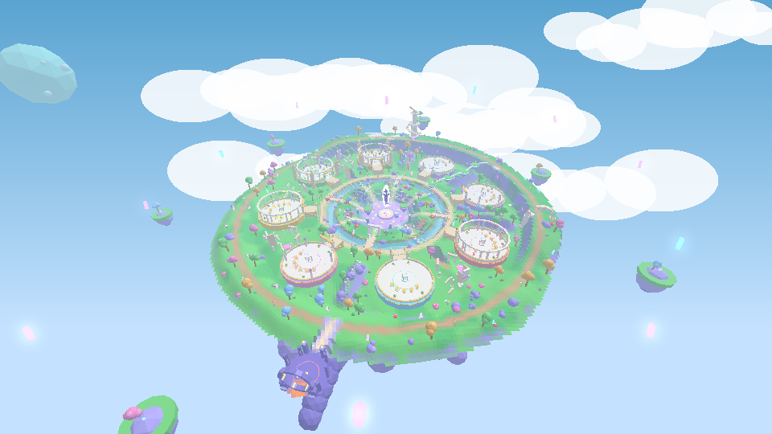
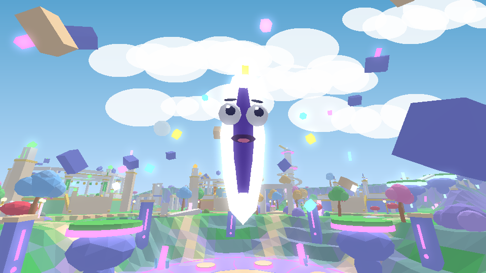
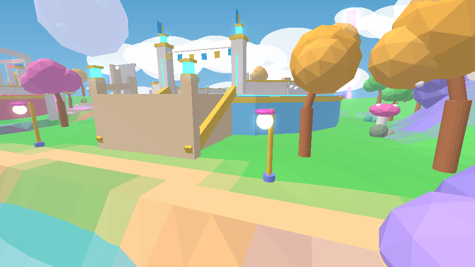
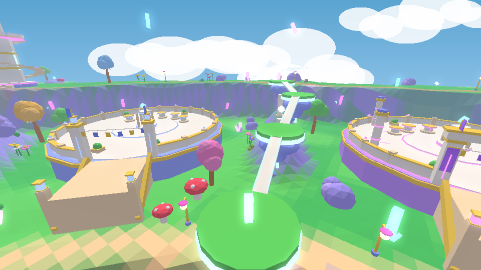
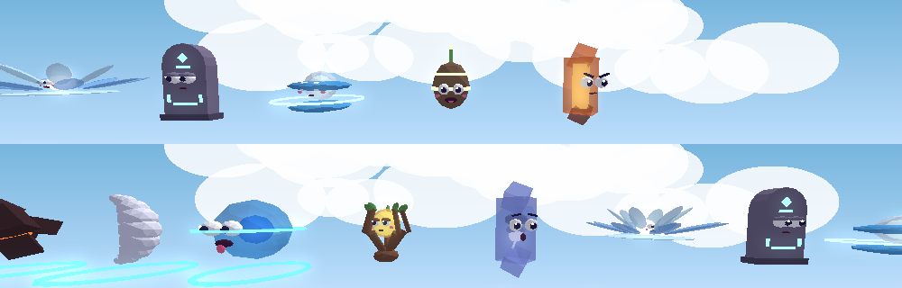
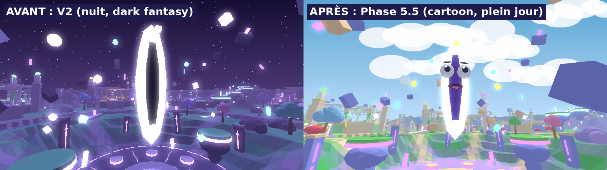

# RIFT HEIST

> *Une faille s'est ouverte au cœur de l'île. Elle crache des reliques cosmiques.
> Attrape-les, ramène-les dans ton Sanctuaire… et protège-les.*

Jeu Roblox multijoueur (6 à 8 joueurs par serveur) écrit en **Luau strict**, géré avec **Rojo**.
Tout le monde — terrain, Faille, sanctuaires, reliques, interface, effets — est généré par le code :
le projet ne dépend d'**aucun asset externe** et se lance tel quel.

| Vue aérienne | La Faille (elle a des yeux !) | Un Sanctuaire |
|---|---|---|
|  |  |  |
| **Prairie, champignons, route céleste** | **Les reliques et leurs têtes** | **Avant / après** |
|  |  |  |

<sub>Aperçus produits par le moteur de rendu logiciel du dépôt (`tools/render`) à partir du monde réellement
généré par le code du jeu (Phase 5.5, direction « Cartoon & Goofy »). Le rendu dans Roblox Studio (éclairage
Future, ombres douces, nuages volumétriques, particules, beams, interface) est plus riche ; l'interface n'apparaît
pas sur ces images. Anciens aperçus V2 (nuit) : `docs/previews/v2_*.png`. Direction artistique complète :
[`docs/ART_DIRECTION.md`](docs/ART_DIRECTION.md).</sub>

> **V2 en cours** — plan validé et état d'avancement : [`docs/V2_PLAN.md`](docs/V2_PLAN.md) (phases 1 « Fondations », 2 « Monde V2 », 3 « Audio dynamique », 4 « Capacités », 5 « Cosmétiques », 5.5 « Direction artistique cartoon » et 6 « Premier boss : Void Warden » terminées).

### Direction artistique (Phase 5.5)

Rift Heist est un jeu **cartoon, goofy et très coloré** pour un jeune public : île-bonbon en plein après-midi,
Faille rose avec de **gros yeux globuleux** qui suivent le joueur et « rote » les reliques (« BURP! »), reliques
avec une **tête et une personnalité** (grognon, endormie, timide, farceuse, à lunettes de soleil…), interface en
**gros boutons ronds colorés** avec contours encre, emojis, gros nombres et récompenses qui explosent en confettis.
Les règles pour toutes les phases suivantes : [`docs/ART_DIRECTION.md`](docs/ART_DIRECTION.md). Les valeurs
vivent dans `Config/Theme` (UI), `Config/Palette` (monde, éclairage) et `Config/Emoji` (emojis autorisés).

### La carte V2 en bref

Le cœur ne change pas (la Faille au centre, prairie, rivière, route circulaire, 8 Sanctuaires à la même distance),
mais l'île est **~37 % plus grande** : une **couronne** vallonnée avec un sentier en boucle entoure les Sanctuaires,
une **corniche haute** domine trois d'entre eux, **deux grottes** passent sous la rivière, quatre **cols en ruines**
relient des Sanctuaires voisins, une **route céleste** d'îles flottantes mène à la corniche, et trois landmarks se
répondent à 90° : **Observatoire**, **Arche brisée**, **Plateau du boss** (portail dormant). 14 **points de grappin**
servent à la capacité Grappin (seules cibles possibles). Détails : `src/shared/WorldFeatures.luau`.

---

## Sommaire

1. [Démarrage rapide](#1-démarrage-rapide)
2. [Principe du jeu](#2-principe-du-jeu)
3. [Installation](#3-installation)
4. [Utilisation de Rojo](#4-utilisation-de-rojo)
5. [Architecture](#5-architecture)
6. [Tester en multijoueur](#6-tester-en-multijoueur)
7. [DataStore et sauvegarde](#7-datastore-et-sauvegarde)
8. [Ajouter une relique](#8-ajouter-une-relique)
9. [Modifier l'économie](#9-modifier-léconomie)
10. [Remplacer les placeholders (sons, musique, polices)](#10-remplacer-les-placeholders)
11. [Commandes de développement](#11-commandes-de-développement-studio)
12. [Tests automatisés et outils](#12-tests-automatisés-et-outils)
13. [Sécurité / anti-exploit](#13-sécurité--anti-exploit)
14. [Performance](#14-performance)
15. [Scénarios de test manuels](#15-scénarios-de-test-manuels)

---

## 1. Démarrage rapide

1. Télécharger **`RiftHeist.rbxl`** (racine du dépôt).
2. Double-cliquer dessus → Roblox Studio s'ouvre.
3. Appuyer sur **Play** (F5). C'est tout.

Au lancement, le monde se construit côté serveur (≈ 1–2 s), l'écran de chargement disparaît, la caméra
fait un court travelling vers la Faille, et le tutoriel guide par le monde lui-même :

> « Une faille vient de s'ouvrir. » → faisceau vers la Faille → « Ramène-la à ton Sanctuaire. »
> → « Place-la sur un piédestal. » → puis l'Essence, le Noyau et les améliorations.

En Studio sans accès API, la partie est jouable avec des données temporaires (un message l'indique).

## 2. Principe du jeu

**Boucle principale** : *Faille → Relique → Transport → Sanctuaire → Essence → Améliorations → Reliques plus rares*.

- **La Faille** (centre de l'île) se charge puis **expulse** des reliques sur des plateformes autour d'elle.
  Chaque apparition est un *moment* : charge, flash, onde de choc, et pour Légendaire/Mythique/Secret une
  annonce serveur, un pilier de lumière visible de partout et un tremblement de caméra.
- **Revendiquer** : maintenir l'interaction près d'une relique. Elle flotte alors **au-dessus de toi** — tout le
  monde voit ce que tu transportes (plus elle est rare, plus tu es lent et visible).
- **Sanctuaire** : chaque joueur reçoit l'un des 8 sanctuaires disposés autour de la vallée. En y entrant, les
  reliques portées se posent **automatiquement** sur un **piédestal** libre (vol plané animé). Une relique
  identique à une relique déjà posée la **fusionne** (niveau +1, jusqu'à 5).
- **Essence** : chaque relique posée produit de l'Essence en continu dans le **Noyau** du sanctuaire
  (capacité limitée → il faut revenir le vider en marchant sur le cercle de collecte).
- **Améliorations** (bouton *Sanctuaire*) : piédestaux, palier du sanctuaire (Avant-poste → Sanctuaire →
  Temple → Citadelle → Nexus, avec reconstruction visuelle animée), Résonance (+% Essence), Foulée (vitesse),
  Harnais (porter 2 puis 3 reliques).
- **RiftDex** : collection des 19 reliques (silhouettes tant qu'elles ne sont pas découvertes) et des mutations
  découvertes. Chaque découverte déclenche une animation et donne un bonus permanent d'Essence.

### Raretés (7)

| Rareté | Poids d'apparition | Essence/s de base | Distinction visuelle (en plus de la couleur) |
|---|---|---|---|
| Commune | 56 % | 1 | lueur simple, quelques particules |
| Peu commune | 25 % | 3 | plus grande, plus lumineuse, plus de particules |
| Rare | 12 % | 8 | anneau au sol + 1 orbiteur, annonce aux joueurs proches |
| Épique | 5 % | 22 | aura + 2 orbiteurs, charge de la Faille plus longue |
| Légendaire | 1,6 % | 60 | pilier de lumière visible de loin + 3 orbiteurs, annonce serveur |
| Mythique | 0,36 % | 160 | 4 orbiteurs + onde de choc périodique |
| Secrète | 0,04 % | 450 | 5 orbiteurs + onde de choc + glitch visuel |

### Mutations (5)

Chargée ×2, Dorée ×3, Néant ×4, Corrompue ×6, Prismatique ×10 — chacune a son propre traitement visuel
(arcs électriques, matériau doré, distorsion sombre, glitch rouge, arc-en-ciel cyclique).

### Événements (4)

Toutes les 4–6 minutes : **RIFT OVERLOAD** (une relique toutes les 1,6 s au lieu de 5,5 s, mutations Chargées ×3), **VOID STORM**
(Néant ×8, ambiance tempête), **GOLDEN SURGE** (Dorées ×6, lumière dorée), **ECLIPSE** (raretés boostées,
relique exclusive *Sceau d'Éclipse*). Chaque événement change l'éclairage, l'atmosphère et la météo.

### Le vol (VOL → COURSE → POURSUITE → SÉCURISATION)

1. **Vol** : maintenir l'interaction sur une relique posée chez un autre joueur (1,2 s pour une Commune
   jusqu'à 4 s pour une Secrète). Le propriétaire reçoit une **alerte** immédiate et voit la barre de progression.
2. **Course** : le voleur porte la relique au-dessus de sa tête, surligné en rouge, et doit rejoindre **son**
   sanctuaire à pied (100 s maximum, sinon la relique rentre chez elle).
3. **Poursuite** : le propriétaire peut le **Repousser** (F) ou le rattraper avec le **Dash** (Q). Une relique
   lâchée par un voleur revient automatiquement chez son propriétaire après 12 s ; le propriétaire peut aussi la
   récupérer immédiatement.
4. **Sécurisation** : déposée dans le sanctuaire du voleur, la relique change de propriétaire.

**Équité / anti-harcèlement** :
- recharge de vol de 40 s ; max 2 vols par paire de joueurs / 10 min ; max 3 vols subis / 15 min ;
- **Égide** : 90 s d'immunité après avoir été volé ;
- **Novice** : impossible d'être volé pendant ses 8 premières minutes de jeu ;
- **Repos** : un joueur inactif (AFK > 150 s) ne peut pas être volé — l'AFK n'est jamais puni ;
- **Dernières reliques** : un sanctuaire avec moins de 3 reliques posées est intouchable ;
- **Sceau** (G) : barrière temporaire du sanctuaire (20–36 s selon le palier, recharge 110 s) qui éjecte les intrus ;
- les reliques posées et le Noyau ne sont **jamais** perdus en se déconnectant.

### Capacités (loadout de 3 emplacements + Sceau)

| Emplacement | Capacités (la 1ʳᵉ est donnée d'office) |
|---|---|
| **Mobilité** (Q / R1) | **Dash** (élan, 3,2 s) · **Blink** (téléportation de 16 studs après 0,3 s, jamais à travers un mur, 8 studs en portant, 6 s) · **Grappin** (vers les 14 points de grappin seulement, 45 studs, ligne de vue, 9 s) |
| **Contrôle** (F / L1) | **Repousser** (recul + étourdit 0,6 s + fait lâcher, 7 s) · **Onde de givre** (ralentit 40 % 2,5 s, sans recul, 9 s) · **Piège runique** (rune visible, s'arme en 1 s, ralentit 60 % 2 s, 1 par joueur, 12 s) |
| **Utilitaire** (R / R2) | **Bouclier** (2 s d'immunité au contrôle dur, porteur ralenti de 20 %, 16 s) · **Leurre** (copie qui court 4 s avec une copie de ta relique, 15 s) · **Phase spectrale** (1,5 s à traverser les joueurs, jamais les murs, relique visible, 14 s) |

- **Anti stun-lock** : après un contrôle dur, 2,5 s d'immunité ; ralentissements non cumulables (≤ 60 %, ≤ 3 s).
- **Déblocage** : Power record + Essence (Bouclier 40/400 … Phase spectrale 420/35 000), écran **Capacités**
  (touche L, croix haut, bouton rond près des capacités). On **équipe seulement dans son Sanctuaire**.
- **Harmonies** : 6 reliques exposées chez soi modifient une capacité (Storm Crystal → traînée de Dash,
  Void Cube → Blink 20 studs, Magma Heart → Éruption, Frost Lotus → Onde de givre renforcée, Chrono Glass →
  Utilitaire −15 %, Cosmic Eye → révèle leurres et phases). Détails et valeurs : `docs/V2_PLAN.md` §9.
- Tout est validé par le serveur (équipement, recharge, portée, destination, ligne de vue, cible, statuts).

### Cosmétiques (purement visuels)

26 cosmétiques originaux en 7 catégories : **Traînées**, **Auras**, **Effets de transport** (autour de la relique
portée), **Thèmes de Sanctuaire**, **Effets d'arrivée** (réapparition), **Effets de sécurisation** (dépôt / fusion)
et **Titres** (au-dessus de la tête). Raretés Commun / Rare / Épique / Légendaire, **aucun effet de jeu** (vitesse,
Power, Essence, recharges, portée, vol, boss, chances, PvP : rien ne lit les cosmétiques). 6 sont offerts ; les
autres se débloquent automatiquement avec la progression existante (Power record, casses, dépôts, récupérations,
RiftDex, palier du Sanctuaire, temps de jeu) et restent acquis pour toujours. Écran **Style** (touche C, croix bas,
bouton « Style » du menu) : filtre par catégorie, état verrouillé / possédé / équipé, condition de déblocage avec
progression, bouton **Essayer** (aperçu local 5 s, même verrouillé). Détails : `docs/V2_PLAN.md` §10.

### Expéditions de boss (Phase 6) — le Void Warden

Toutes les **10 minutes**, le portail du **Plateau du boss** s'ouvre pendant **60 s** (annonce 30 s avant,
compte à rebours sur la barre « Boss » du HUD et sur un panneau au-dessus du portail). Devant le portail, la
carte du boss (une « affiche de catch ») montre le boss en 3D, son rang, sa difficulté, le **Power recommandé
(150)** face au tien, le **Power record minimum (25)** et **chaque récompense avec sa probabilité exacte** pour
chaque joueur éligible : Essence (5 min de ta production, 100 %), Éclats du Néant ×3–6 (100 %), Catalyseur du
Néant (15 %), relique exclusive **Plumeau du Néant** (8 %), traînée exclusive **Bulles de savon** (5 %).
On entre seul ou à plusieurs (**reliques en main interdites**, la règle la plus sûre), dans une arène flottante
lointaine (« le placard du concierge du Néant ») : pas de PvP dedans, Sanctuaire protégé (« Expédition »)
tant qu'on participe. **Prêt !** de tout le monde lance le combat plus tôt.

Le **Void Warden** est un gros cube de gelée violet, casquette de concierge, énormes yeux, moustache, gants
flottants et balai géant (pièces Roblox natives, pas de modèle sculpté). Ses attaques sont **toutes annoncées**
(zone qui se remplit du jaune au rouge, ≥ 0,8 s ; 2 s pour la spéciale) : **coup de balai** (anneau de poussière
à sauter), **flaques collantes** (cercles qui font SPLAT puis ralentissent), **moutons de poussière** lancés en
cloche (marques au sol), **plat ventre** (une ombre grossit où il atterrit), et en phase 2 le **Grand Ménage**
(trois quarts de l'arène balayés, un quart qui brille est sûr ; il finit étourdi : dégâts ×1,5). Phases : grognon
(100–60 %), fâché (60–25 %), rouge comme une tomate (< 25 %). Chacun a **4 cœurs** (1,5 s d'invincibilité après un
coup) ; KO = retour au plateau. **Frappe** (clic / E / X / gros bouton) : seulement dans l'arène, portée et
dégâts calculés par le serveur ; le Power actuel donne au plus **+25 %** de dégâts **contre les boss** (jamais en
PvP). Les PV du boss augmentent de 70 % par joueur supplémentaire ; un débutant peut gagner seul en 3:30.
Récompenses **individuelles**, tirées côté serveur, seulement pour les participants éligibles (≥ 20 % d'une part
équitable des dégâts, encore là, ni AFK ni partis), **jamais deux fois pour le même combat**. La relique de boss
va sur un **socle de trophée non volable** (1 à 3 socles débloqués par le Power record) ; un doublon la fait
monter de niveau. **Boss Codex** : découverte, tentatives, victoires, meilleur temps, trouvailles rares, matériaux
gardés pour la future Forge. Détails : `docs/V2_PLAN.md` §12.

### Rythme visé

- 30 s : comprendre (tutoriel par le monde, faisceau, flèche de bord d'écran).
- 2 min : plusieurs reliques posées, première Essence (cadeau de bienvenue de 40 Essence au premier dépôt).
- 5 min : première amélioration visible (nouveaux piédestaux qui surgissent du sol).
- 10–15 min : objectif rare (palier 2 du sanctuaire, première Épique/Légendaire, premier événement).

### Contrôles

| Action | Clavier | Manette | Mobile |
|---|---|---|---|
| Interagir (revendiquer, voler, inspecter) | E (appui / maintien) | X | toucher / maintenir la carte |
| Capacité de Mobilité (Dash / Blink / Grappin) | Q | R1 | bouton |
| Capacité de Contrôle (Repousser / Onde de givre / Piège) | F | L1 | bouton (le plus gros) |
| Capacité Utilitaire (Bouclier / Leurre / Phase) | R | R2 | bouton (si équipée) |
| Sceller le sanctuaire | G | Y | bouton |
| Écran Capacités (loadout, déblocages, harmonies) | L | croix haut | bouton rond à gauche des capacités |
| Écran Style (cosmétiques) | C | croix bas | bouton « Style » du menu |
| Carte du boss (portail, récompenses) | E devant le portail | X | toucher la carte / barre « Boss » du HUD |
| **Frappe** (arène du boss uniquement) | clic gauche ou E | X | gros bouton FRAPPE |
| Sauter par-dessus le coup de balai | Espace | A | bouton de saut |
| Fermer un menu | Échap | B | ✕ |

Blink et Leurre partent dans la direction du déplacement (sinon vers l'avant du personnage). Le Grappin vise
le point de grappin marqué (cercle cyan) le plus proche de la direction de la caméra.

## 3. Installation

### Pour jouer / tester uniquement
Roblox Studio suffit : ouvrir `RiftHeist.rbxl` (voir [Démarrage rapide](#1-démarrage-rapide)).

### Pour développer
Prérequis : Roblox Studio, [Rokit](https://github.com/rojo-rbx/rokit) (ou Aftman), Git.

```bash
git clone <ce dépôt>
cd steal-project
rokit install          # installe rojo 7.6.1, luau-lsp 1.55.0, lune 0.10.4 (voir rokit.toml)
# ou : aftman install  (aftman.toml)
```

Dans Roblox Studio, installer le **plugin Rojo** (Plugins → Manage Plugins, ou `rojo plugin install`).

## 4. Utilisation de Rojo

**Synchronisation en direct** (recommandé pendant le développement) :

```bash
rojo serve default.project.json
```

Puis dans Studio : ouvrir `RiftHeist.rbxl` (ou un baseplate vide), onglet **Rojo → Connect**.
Chaque sauvegarde d'un fichier `.luau` est répercutée instantanément dans Studio.

**Construire le fichier de place** :

```bash
rojo build default.project.json -o RiftHeist.rbxl
```

`default.project.json` configure aussi les services : `Lighting` (Future, Atmosphere, Bloom, SunRays,
ColorCorrection, DepthOfField, Sky), `StarterPlayer` (caméra, vitesse, saut), `Players` (spawn manuel par le
serveur), `Workspace` (gravité, Streaming désactivé — la carte est compacte), `Terrain` (herbe décorative).

**Publier** : ouvrir le `.rbxl` dans Studio → File → Publish to Roblox. Activer ensuite les DataStores (§7).

## 5. Architecture

```
src/
├── shared/                   → ReplicatedStorage.Shared (client + serveur)
│   ├── Config/               toutes les valeurs de design, centralisées
│   │   ├── GameConfig.luau   vitesses, temps, distances, règles de vol, économie, sauvegarde…
│   │   ├── Rarities.luau     7 raretés : poids, Essence, échelle, lumière, habillage visuel
│   │   ├── Mutations.luau    5 mutations : chance, multiplicateur, apparence
│   │   ├── Relics.luau       catalogue des 19 reliques (ordre = ordre du RiftDex)
│   │   ├── Upgrades.luau     améliorations et tables de coûts explicites
│   │   ├── Abilities.luau    emplacements de loadout + catalogue des capacités (V2)
│   │   ├── Power.luau        coefficients du Power Level (V2)
│   │   ├── Events.luau       4 événements : durée, effets, ambiance (lumière/atmosphère/météo)
│   │   ├── Sounds.luau       registre audio (id / fallback / note de design)
│   │   ├── Theme.luau        jetons UI cartoon : couleurs, boutons, contours, polices, couleurs des sanctuaires
│   │   ├── Palette.luau      palette du monde, terrain, matériaux « jouet », éclairage de jour (Phase 5.5)
│   │   ├── Emoji.luau        emojis autorisés (fiables sur tous les appareils) (Phase 5.5)
│   │   ├── Bosses.luau       portail, arène, règles de combat, Void Warden (phases, attaques, butin exact) (Phase 6)
│   │   └── Materials.luau    matériaux de boss pour la future Forge (Phase 6)
│   ├── Locale/               textes EN/FR (choix auto selon la langue Roblox, modifiable en jeu)
│   ├── Relics/               RelicFactory (assemblage visuel, habillage, mutations, LOD) + RelicShapes
│   │                         + RelicFaces (visages cartoon, regard vers le joueur, clignements)
│   ├── Util/                 Signal, Trove, Format, RateLimiter, MathUtil
│   ├── Economy.luau          formules pures (production, coûts, capacités) — partagées client/serveur
│   ├── Power.luau            formule pure du Power Level (V2)
│   ├── Status.luau           règles pures de contrôle : stun/root/ralentissement, anti stun-lock (V2)
│   ├── Layout.luau           géométrie de la carte (positions des sanctuaires, piédestaux, spots)
│   └── Net.luau              noms des RemoteEvents/RemoteFunctions
├── server/                   → ServerScriptService.Server
│   ├── init.server.luau      bootstrap : monde, services, joueurs, sync, autosave, BindToClose
│   ├── Core/                 Remotes (rate-limit + pcall), Sessions, DataSchema, Rolls, Snapshot (Sync
│   │                         chaud/froid), Scheduler (boucle unique de tous les jobs périodiques), Types
│   ├── Abilities/            logique serveur de chaque capacité (V2)
│   ├── Bosses/               comportement de chaque boss (planification des attaques) : VoidWarden (Phase 6)
│   ├── Services/
│   │   ├── DataService       DataStore : UpdateAsync, verrou de session, retries, autosave
│   │   ├── PlotService       attribution des sanctuaires, file d'attente, protections, Sceau
│   │   ├── RiftService       charge / expulsion des reliques, durée de vie, file forcée
│   │   ├── RelicService      entités reliques (états Rift/Carried/Placed/Dropped), ProximityPrompts
│   │   ├── CarryService      revendiquer, porter, lâcher, déposer, fusion, vol sécurisé, déconnexions
│   │   ├── StealService      règles de vol, vérification du temps de maintien, Égide, limites
│   │   ├── AbilityService    framework de capacités : loadout, validation, cooldowns, Sceau (V2)
│   │   ├── StatusService     applique les contrôles (stun, root, ralentissement, bouclier) (V2)
│   │   ├── EconomyService    Essence, Noyau, hors-ligne, recalculs
│   │   ├── UpgradeService    achats validés côté serveur
│   │   ├── DexService        découvertes RiftDex + bonus
│   │   ├── EventService      planification et déclenchement des événements
│   │   ├── CharacterService  spawn, groupes de collision, vitesse, étourdissement, vide
│   │   ├── MovementGuard     détection de téléportation / vitesse anormale
│   │   ├── BossService       portail, arène, combat, cœurs, Frappe, récompenses, Codex, nettoyage (Phase 6)
│   │   ├── TrophyService     socles de trophées (reliques de boss non volables) (Phase 6)
│   │   ├── TutorialService   progression du tutoriel
│   │   └── DevCommands       commandes /rh (Studio uniquement)
│   └── World/                génération procédurale : TerrainBuilder, RiftBuilder (+ visage de la Faille),
│                             SanctuaryBuilder, Props (ponts, gués, lampadaires, arbres, fleurs géantes,
│                             champignons, cristaux, ruines, ciel), Ambience (éclairage de jour), Parts,
│                             ArenaBuilder (arène du boss, construite à la demande)
└── client/                   → StarterPlayerScripts.Client
    ├── init.client.luau      bootstrap client + routage des effets serveur
    ├── ClientNet.luau
    ├── Abilities/            prédiction + ressenti client de chaque capacité (V2)
    ├── Controllers/          Store (état), Settings, Audio, CameraFX, LightingFX, RelicRenderer,
    │                         RiftFX, SanctuaryFX, CharacterFX, Abilities, Prompts, WorldFX, Tutorial,
    │                         Boss (Frappe, rejoindre), BossFX (corps du boss, télégraphes, effets)
    ├── Boss/                 VoidWardenModel (corps cartoon en pièces natives) (Phase 6)
    └── UI/                   couches HUD / modales / overlay, mise à l'échelle par résolution
        ├── Kit/              Create, Style, Tween, Button (bouton « chunky »), Icons, RelicViewport, Text,
        │                     Modal (ruban de titre), Juice (confettis, « +250! », étoiles, rayons)
        └── Screens/          TopStack, Hud, Shop, Dex, Inspect, SettingsMenu, Discovery,
                              Notifications, Announcer, EventBanner, Loading,
                              BossHud, BossPortal, BossCodex (Phase 6)
tests/                        harnais headless (Lune) + scénarios
tools/                        analyse statique, rendu d'aperçus
```

**Principes** :
- **Serveur autoritaire** : chaque relique est une entité serveur (Part invisible dans `workspace.Relics`)
  dont l'état est porté par des attributs. Les **visuels sont construits côté client** à partir de ces
  attributs (`RelicRenderer` + `RelicFactory`) : réplication minimale, effets riches, LOD par client.
- Le serveur envoie l'état du joueur (`Sync`) en deux moitiés : **chaude** (Essence, cooldowns, portage,
  statuts, Power) au plus toutes les 0,1 s quand elle change, et **froide** (RiftDex, améliorations, loadout,
  réglages…) seulement quand elle change ; le client fusionne et ne fait qu'afficher et demander.
- Tous les traitements périodiques serveur passent par `Core/Scheduler` (une seule connexion Heartbeat,
  erreurs isolées par job).
- Les **effets** (apparition, vol, dépôt, tier-up…) sont des messages `Fx` routés par type côté client.
- Aucune valeur de design en dur : tout est dans `Shared/Config`.

## 6. Tester en multijoueur

Dans Roblox Studio : onglet **Test** → section *Clients and Servers* → choisir **2 à 8 joueurs** →
**Start**. Studio ouvre un serveur et une fenêtre par joueur.

Scénario conseillé à 2 joueurs :
1. Joueur 1 : `/rh novice` (lève sa protection Novice), puis poser au moins 3 reliques
   (`/rh spawn Rare` en fait apparaître ; `/rh pedestals 2` + `/rh essence 5000` pour avoir de la place).
2. Joueur 2 : aller au sanctuaire du joueur 1 et maintenir **Voler** sur une relique posée.
   Le joueur 1 doit avoir bougé dans les 150 dernières secondes, sinon il est protégé (*Repos*).
3. Joueur 1 reçoit l'alerte : le poursuivre, utiliser **Repousser** (F) → la relique tombe et revient chez lui.
4. Rejouer en laissant le voleur atteindre son sanctuaire → « Casse réussi », transfert de propriété.
   (L'Égide de 90 s de la victime démarre dès le vol : attendre ou relancer la session pour un nouveau vol.)

Pour 6–8 joueurs : même procédure ; à partir du 9ᵉ joueur, la file d'attente des sanctuaires est utilisée.

## 7. DataStore et sauvegarde

- Studio : **File → Game Settings → Security → Enable Studio Access to API Services** (le jeu doit être
  publié). Sans cela le jeu fonctionne avec des **données temporaires** (message « Studio : DataStores
  indisponibles »), rien n'est écrit.
- Store : `RiftHeist_Player_v1`, clé `u_<UserId>`, schéma versionné (`GameConfig.Data.SchemaVersion`,
  actuellement **5** : la V2 ajoute le loadout de capacités et le Power record (2), les interrupteurs
  d'harmonies (3), l'inventaire de cosmétiques (4) puis le **Boss Codex**, les **matériaux** et les **trophées**
  (5) ; les sauvegardes V1 à V4 sont migrées automatiquement sans perte).
- Boss : les récompenses sont écrites dans la session **et sauvegardées immédiatement** ; l'identifiant du combat
  payé est gardé dans le Codex, si bien qu'un même combat ne peut jamais payer deux fois (déconnexion, crash,
  relance).
- **Garde anti-écrasement** : un profil écrit par une version plus récente du jeu n'est jamais verrouillé,
  normalisé ni réécrit par un serveur plus ancien (le joueur joue avec des données temporaires et est invité à
  changer de serveur). Les serveurs V1 n'ont pas cette garde : à la publication de la V2, utiliser
  **Shut Down All Servers**.
- Chargement avec `UpdateAsync` + **verrou de session** (job id + horodatage, expiration 600 s) : un autre
  serveur ne peut pas écraser un profil en cours d'utilisation.
- Jusqu'à 5 tentatives avec backoff. Si le chargement échoue, le joueur joue avec des données temporaires
  et la sauvegarde est **désactivée** pour cette session (on n'écrase jamais une vraie sauvegarde par du vide),
  avec un avertissement à l'écran.
- Sauvegarde automatique toutes les 90 s (étalée entre joueurs), à la déconnexion, et dans `BindToClose`
  (attente des sauvegardes en cours, 25 s max).
- `DataSchema.normalize` assainit toute donnée chargée (types, bornes, reliques inconnues) ; les migrations
  se déclarent dans la table `MIGRATIONS` de `Server/Core/DataSchema.luau` (incrémenter `SchemaVersion`).
- Production hors-ligne : 50 % du taux, plafonnée à 8 h et à la capacité du Noyau.

## 8. Ajouter une relique

1. **`src/shared/Config/Relics.luau`** — ajouter une entrée dans `list` (la position = position dans le RiftDex) :
   ```lua
   {
       id = "crystal_comet",          -- identifiant unique, jamais renommé (il est sauvegardé)
       rarity = "Epic",               -- Common | Uncommon | Rare | Epic | Legendary | Mythic | Secret
       shape = "CrystalComet",        -- nom du builder dans RelicShapes
       rateFactor = 1,                -- ajustement de l'Essence au sein de la rareté
       spawnWeight = 1,               -- poids dans sa rareté (0 = jamais naturellement)
       -- eventOnly = "Eclipse",      -- optionnel : n'apparaît que pendant cet événement
       primary = Color3.fromRGB(120, 200, 255),
       secondary = Color3.fromRGB(40, 60, 120),
       glow = Color3.fromRGB(180, 230, 255),
       dexIndex = 0,                  -- calculé automatiquement
   },
   ```
2. **`src/shared/Relics/RelicShapes.luau`** — ajouter `Shapes.CrystalComet = function(ctx: Ctx) … end`.
   Le contexte fournit `ctx:part`, `ctx:ring`, `ctx:emitter`, `ctx:light`, `ctx:animate`… (voir les 19
   builders existants : géométrie en primitives, taille ≈ 2–3 studs, l'habillage de rareté/mutation est
   ajouté automatiquement par `RelicFactory`).
3. **`src/shared/Locale/Strings.luau`** — ajouter `relic.crystal_comet.name` et `relic.crystal_comet.lore`
   dans les tables `en` **et** `fr`.
4. Lancer `lune run tests/run.luau` : le test *Factory* construit chaque relique × chaque mutation et
   vérifie qu'il n'y a ni erreur ni propriété invalide.

### Ajouter une capacité (framework V2)

1. **`src/shared/Config/GameConfig.luau`** (`Abilities.<Nom>`) : les valeurs ; **`src/shared/Config/Abilities.luau`** :
   une entrée (`id`, `slot` = `Mobility` | `Control` | `Utility`, `module`, `cooldown`, `lenience`, `default`,
   `needsMovement`, `payload` = `none` | `direction` | `anchor`, `icon`, `color`, `counterplay`, `tuning`,
   `unlock = { power, essence, materials = {} }` si elle n'est pas donnée d'office).
2. **`src/server/Abilities/<Module>.luau`** : `activate(ctx)` (effet), et au besoin `readPayload(raw)` (assainit
   ou refuse), `validate(ctx)` (refus sans coût avant le cooldown), `tick(now)` (travail périodique, un seul job
   pour toutes les capacités) et `cleanup(session, reason)` (mort, réapparition, départ, déséquipement, balayage).
   `ctx.tuning` / `ctx.cooldown` incluent déjà les harmonies. Tout contrôle sur un autre joueur passe par
   `StatusService` ; les questions de géométrie par `Server/Abilities/Common` (raycasts, sol, ligne de vue).
3. **`src/client/Abilities/<Module>.luau`** : `activate(ctx)` (prédiction + effets) qui renvoie le payload,
   `canUse(ctx)` et `denied(reason)` au besoin ; les effets vus par tous vont dans `Controllers/AbilityFX`.
4. **`src/shared/Locale/Strings.luau`** : `ability.<id>`, `ability.<id>.desc`, `ability.<id>.stats` (en et fr) ;
   une icône dans `UI/Kit/Icons.luau`.

Le cooldown, l'équipement, les statuts, la limite de débit, le nettoyage et l'écran Capacités sont gérés par le
framework (`AbilityService`, `UI/Screens/Loadout`).

## 9. Modifier l'économie

| Pour changer… | Fichier |
|---|---|
| Essence par rareté, poids d'apparition, temps de vol, ralentissement en portage | `Config/Rarities.luau` |
| Chance et multiplicateur des mutations | `Config/Mutations.luau` |
| Coûts et niveaux max des améliorations | `Config/Upgrades.luau` (tables `costs` explicites) |
| Capacité du Noyau, bonus de fusion/Résonance/RiftDex, hors-ligne, cadeau de bienvenue | `Config/GameConfig.luau` → `Economy` |
| Cadence de la Faille, nombre max de reliques, durée de vie | `GameConfig.luau` → `Rift` |
| Règles de vol (recharges, limites, Égide, Novice, AFK) | `GameConfig.luau` → `Steal` |
| Fréquence et effets des événements | `Config/Events.luau`, `GameConfig.luau` → `Events` |
| Formules elles-mêmes | `Shared/Economy.luau` (fonctions pures, utilisées par le serveur et l'UI) |

Formule de production d'une relique posée :
`Essence/s = rate(rareté) × rateFactor × mutation × (1 + 0,6 × (niveau − 1))`, puis
× (1 + 0,15 × Résonance) × (1 + 0,02 × reliques découvertes + 0,01 × mutations découvertes).

Le test *Economy sanity* vérifie les formules, les plafonds de piédestaux par palier et la distribution des raretés sur 20 000 tirages.

## 10. Remplacer les placeholders

Le projet **n'utilise aucun ID d'asset inventé**. Tout ce qui demanderait un asset est centralisé :

### Sons — `src/shared/Config/Sounds.luau`
Chaque clé possède :
- `id` : **vide** par défaut → coller ici un `rbxassetid://…` que vous avez importé ou dont vous avez la licence ;
- `fallback` : un son livré avec chaque client Roblox (`rbxasset://sounds/...`), joué tant que `id` est vide,
  avec un pitch/volume réglés pour approcher l'intention ;
- `note` : description du son final attendu.

Clés à remplacer en priorité : `RiftHum` (drone en boucle), `RiftCharge`, `RelicEmerge`, `RareEmerge`,
`Deposit`, `StealAlert`, `HeistSecured`, `TierUp`, `Discovery`, `EventStart`.
`AmbientWorld` (fond sonore nocturne en boucle, sous la musique) reste **silencieux** tant qu'aucun `id`
n'est fourni.

### Musique dynamique — `src/shared/Config/Music.luau`
La musique change selon ce qui se passe, par priorité : **Boss > Poursuite > Événement > près de la Faille >
Exploration**. Une seule musique principale à la fois (fondu enchaîné à puissance constante pendant les
transitions), anti-va-et-vient (délai d'entrée, maintien après la fin, intervalle minimal avant de redescendre),
retour naturel à la musique précédente (reprise là où elle s'était arrêtée).

**Ajouter vos musiques :**
1. Importer la piste dans Roblox (Creator Hub → Audio) ou utiliser un audio dont vous avez la licence.
2. En haut de `Config/Music.luau`, dans le bloc **`ASSET_IDS`**, coller l'ID sur la ligne de l'emplacement :
   `Explore = "rbxassetid://123456789",` (la description de chaque emplacement — type, boucle/one-shot,
   ambiance, tempo, durée, contexte — est juste en dessous, dans `Music.Tracks`).
3. Rien d'autre à modifier : le directeur musical l'utilise automatiquement.

Déjà renseignés : `Explore`, `Rift`, `Chase`, `ChaseIntense` et `Stinger.ChaseStart`. Tous les autres
(événements, boss, autres stingers) sont encore vides.
Un emplacement sans `id` reste **muet** (aucun `Sound` n'est créé) et l'état inférieur continue de jouer.
Emplacements : `Explore`, `Rift`, `Chase`, `ChaseIntense`, `Event.<Id>` (+ `Event.Default`),
`Boss.<BossId>.<phase>` (+ `Boss.Default.<phase>`), et les stingers `Stinger.ChaseStart`, `Stinger.BossIntro`,
`Stinger.BossVictory`, `Stinger.BossDefeat`. Réglages (délais, rayons de la Faille, fondus) : `Music.States`
et `Music.Settings`. Le volume suit le réglage « Musique » du joueur.

### Textures / polices
- Particules : textures intégrées `rbxasset://textures/particles/...` (toujours disponibles).
- Polices : familles intégrées Builder Sans, Fredoka One, Luckiest Guy (`Config/Theme.luau` → `Fonts`).
- Emojis : uniquement ceux de `Config/Emoji.luau` (un test refuse tout autre emoji dans `src/`).
- Ce qui mériterait de **vrais assets** (modèles 3D, illustrations, animations, SFX cartoon) :
  `docs/ART_DIRECTION.md` §14.
- Avatars sur les panneaux des sanctuaires : `rbxthumb://` (miniatures Roblox officielles).
- Icônes d'interface : dessinées en primitives UI (`UI/Kit/Icons.luau`) — remplaçables par des images.

### Monétisation
Aucune. Pas de Game Pass, pas de Developer Product, pas de mécanique prédatrice. Si vous en ajoutez,
créez les produits sur le site Roblox et référencez leurs vrais IDs dans `GameConfig`.

## 11. Commandes de développement (Studio)

Actives **uniquement dans Studio** (`RunService:IsStudio()`), via le chat :

| Commande | Effet |
|---|---|
| `/rh essence [n]` | ajoute n Essence (10 000 par défaut) |
| `/rh core [n]` | remplit le Noyau de n Essence |
| `/rh spawn <rareté\|id> [mutation]` | force une apparition (`/rh spawn Secret`, `/rh spawn void_cube Prismatic`) |
| `/rh event <id>` | déclenche `RiftOverload`, `VoidStorm`, `GoldenSurge` ou `Eclipse` |
| `/rh tier <1-5>` | change le palier du sanctuaire (avec animation) |
| `/rh pedestals <n>` | niveau de l'amélioration piédestaux |
| `/rh novice` | termine la protection Novice |
| `/rh abilities [off]` | toutes les capacités équipables pour la session (**jamais sauvegardé** ; les vrais déblocages ne changent pas) |
| `/rh cooldowns` | remet à zéro tes recharges |
| `/rh cosmetics [off\|reset]` | tous les cosmétiques équipables pour la session (**jamais sauvegardé**) · `off` : retire ce qui n'est pas possédé · `reset` : inventaire ramené aux 6 cosmétiques de départ (les déblocages reviennent selon ta progression) |
| `/rh boss open` · `start` · `hp <%>` · `win` · `stop` | ouvre le portail tout de suite · lance le combat sans attendre · fixe les PV du boss · le laisse à 1 PV · termine l'expédition |
| `/rh boss shards <n>` · `codex` | ajoute des Éclats du Néant · vide ton Codex (pour retester la découverte) |
| `/rh reset` | réinitialise les données (kick) |

## 12. Tests automatisés et outils

### Analyse statique (Luau strict)
```bash
tools/analyze.sh          # rojo sourcemap + luau-lsp analyze avec les définitions Roblox
```
Tous les fichiers de `src/` sont `--!strict` et passent l'analyse sans erreur.

### Suite de tests headless
```bash
lune run tests/run.luau
```
Le harnais (`tests/harness`) simule le moteur Roblox : temps virtuel, `task.*`, signaux différés,
Players/DataStore/RemoteEvents/TweenService… et **valide chaque propriété/méthode utilisée contre
l'API-Dump officiel de Roblox** (membres inconnus, types, propriétés en lecture seule). Le vrai code
serveur et un vrai client tournent dedans. Résultat actuel : **1355 vérifications, 0 échec, 0 erreur d'exécution**
(1094 des phases précédentes, inchangées — V1, V2 phases 1 à 5.5 —, 1 contrôle automatique de plus pour le nom du nouveau cosmétique, et 260 de la
phase 6 dans `tests/scenarios/V2Bosses.luau`). `ONLY=bosses lune run tests/run.luau` saute les scénarios V2 sans
rapport avec les boss pour itérer plus vite (≈ 40 s). Le harnais sait lancer des rayons (`workspace:Raycast`, `RaycastParams`,
groupes de collision, terrain en voxels) pour valider Blink, Grappin, lignes de vue et pièges.

Vérifications du monde seules (≈ 7 s, sans joueurs) : `lune run tests/world.luau`. Elles suivent chaque route
déclarée dans `WorldFeatures.Routes` **dans les deux sens** avec un « marcheur » géométrique (hauteur de marche
≤ 2,2 studs, trous seulement sur les gués, rien de solide dans le corps du personnage, nage sur la rivière),
vérifient les grottes (creusées, plafond sous la rivière, pentes, éclairage), les trajectoires des pads de rebond,
l'escalier de l'Observatoire, les ancres de grappin, les budgets (parts, lumières, particules) et que rien ne
touche les Sanctuaires, leurs rampes ni la Faille.

Scénarios couverts : solo complet (tutoriel → dépôt → Essence → achats → fusion → dissolution), achat sans
argent, interactions à distance, spam de remotes, 2ᵉ joueur + protection Novice, vol → alerte → poursuite →
récupération, Égide + recharge + limites par paire, casse réussi, double revendication, voleur qui quitte en
plein vol, victime qui quitte en plein vol, mort en portant, chute dans le vide, exploit de téléportation,
serveur plein (9ᵉ joueur en file d'attente), panne DataStore, reconnexion, événements, cohérence de
l'économie, sauvegarde falsifiée, démarrage client (HUD, menus, découvertes, langues, qualité), construction
de toutes les reliques × mutations, `BindToClose`.
V2 phase 1 : migration d'une **vraie sauvegarde V1** (`tests/fixtures/save_v1.json`, produite par le code V1),
garde contre les schémas plus récents (y compris en concurrence), champs V2 falsifiés, Power (formule, record,
non modifiable par le client), règles de Status et anti stun-lock en conditions réelles (essaim d'attaquants),
ralentissements/enracinement/bouclier, framework de capacités (validation, alias V1, loadout, spam), Sync
chaud/froid (taille, fusion côté client, audit), Scheduler (jobs isolés), reconnexions.
V2 phase 4 : chaque capacité dans une arène de test (murs fins, rebords, plafonds, vide, Sanctuaire scellé),
les 14 points de grappin réels (tous atteignables), recharges, portée, obstacles, transport d'une relique,
anti stun-lock, harmonies (les 6), déblocages et matériaux futurs, schéma 3, loadout au Sanctuaire uniquement,
déblocage de test Studio, requêtes falsifiées (capacité non équipée, ids inconnus, payloads, faux cooldowns,
fausses harmonies, ancres inventées), spam, `MovementGuard` (Dash, Grappin, téléportation déguisée), mort /
réapparition / déconnexion pendant une capacité, balayage des objets orphelins, HUD et écran Capacités côté client,
et **3 poursuites à 2 joueurs** (vol → mobilité → contrôle → contre-jeu → récupération ou sécurisation) sans
duplication, perte, téléportation abusive ni contournement de recharge.
V2 phase 5 : catalogue et budgets, analyse du code source (aucun module de gameplay ne lit les cosmétiques),
schéma 4 (migration d'une sauvegarde de phase 4 et d'une vraie sauvegarde V1, inventaire falsifié, sauvegarde d'un
schéma plus récent jamais réécrite), équipement refusé pour un id inventé / non possédé / de mauvaise catégorie /
illisible, inventaire client falsifié, spam et changements rapides, déblocage Studio jamais sauvegardé,
déblocages automatiques, aucun effet de jeu avec un cosmétique dans chaque catégorie, rendu client (chaque
catégorie, transport, dépôt, réapparition, aperçu), 8 joueurs équipés (LOD, plafonds d'auras / lumières, aucune
boucle ajoutée, nettoyage au départ), écran Style.
Phase 5.5 (direction artistique) : contrastes du texte blanc sur les panneaux (≥ 4,5:1), lèvres de boutons plus
sombres, polices intégrées uniquement, étoiles de rareté, **politique emoji** (analyse de tout `src/` : seulement
les emojis fiables de `Config/Emoji`, aucun sélecteur de variante, aucun emoji à présentation texte), aucun ID
d'asset ajouté, éclairage de jour appliqué par le serveur **identique** à `default.project.json`, plus aucun
matériau réaliste sur les ~4 200 pièces du monde, couleurs du terrain, décorations jamais solides ni « raycastables »,
couleurs des Sanctuaires toutes différentes + fanions, visage de la Faille (yeux tournés vers la caméra de chaque
client, « BURP! » et bouche qui s'ouvre à l'apparition d'une relique), visages des reliques (qui en a un, regard
vers le joueur le plus proche, clignement, mutations sans effet sur les yeux, chaque relique × mutation), HUD
(grille 2×2 de gros boutons emoji ≥ 44 px, compteur d'Essence), bouton « chunky » (familles, désactivé, setKind),
rubans des 5 modales, plafond des confettis, pastilles de rareté au-dessus des reliques, et aucune lecture des
nouveaux modules visuels par le code de gameplay.

### Aperçus du monde et des reliques (direction artistique)
```bash
lune run tools/render/export_world.luau 0                         # 0 = paliers mixtes
python3 tools/render/render_map.py tools/.cache/world.json map.png # vue de dessus (grottes en surbrillance)
python3 tools/render/render_view.py tools/.cache/world.json view.png "0,41,-150" "0,24,0" 800 450
FOG=0.0012 python3 tools/render/render_view.py ...                 # brouillard réduit (vues aériennes)
NIGHT=1 python3 tools/render/render_view.py ...                    # ancien rendu de nuit (comparaisons)
lune run tools/render/export_relics.luau                          # les 19 reliques alignées (visages compris)
python3 tools/render/render_view.py tools/.cache/relics.json relics.png "-18.2,8.4,-8.5" "-18.2,8,0" 1000 330
```
(`render_view.py` : rastériseur logiciel avec brouillard, néon émissif et bloom, ciel de jour et couleurs du terrain
lus dans la palette exportée ; nécessite numpy + Pillow. Ce n'est pas le moteur de Roblox : composition seulement.)

## 13. Sécurité / anti-exploit

- Toutes les remotes passent par `Core/Remotes` : **limiteur à jetons** par joueur et par remote, `pcall`,
  validation des types et des valeurs (allow-lists pour réglages et tutoriel).
- Le client ne fait que *demander* : revendiquer, voler, déposer, acheter, capacités — le serveur vérifie
  distance, état de l'entité, propriétaire, recharges, coût, capacité.
- Vol : le serveur mesure lui-même la durée de maintien (≥ 80 % de la durée requise).
- Capacités : le client envoie l'id et **au plus une direction ou un index de point de grappin** ; le serveur
  vérifie qu'elle est connue, équipée, que le personnage peut agir (statuts), que le cooldown (stocké par
  capacité) est écoulé, puis calcule lui-même destinations (raycasts), cibles, ligne de vue, placement des
  pièges, ancre (lue dans `WorldFeatures`) et harmonies (reliques réellement exposées). Le loadout et les
  harmonies ne se modifient qu'au Sanctuaire ; les déblocages exigent le Power record et l'Essence. Tout
  contrôle passe par `StatusService` (immunité après contrôle dur, ralentissements non cumulables, durées
  plafonnées). Pièges, leurres, préparations et vols de grappin sont nettoyés à la mort, au départ, au
  déséquipement et par un balayage périodique.
- `MovementGuard` : un déplacement horizontal > 120 studs/s fait lâcher les reliques portées ; au-delà de
  2,5× cette limite (téléportation), le personnage est ramené à sa dernière position valide. Le Dash relève
  le seuil à 160 studs/s pendant 0,6 s (plus de fenêtre de grâce totale) ; le Grappin reste sous le seuil ;
  le Blink est un déplacement fait par le serveur et signalé au garde.
- Cosmétiques : le client envoie seulement (catégorie, id) ; le serveur vérifie l'id, la catégorie et la
  **possession** (inventaire serveur), puis publie l'équipement en attributs (`Cos_<catégorie>`, `Theme`). Aucune
  remote ne peut ajouter un cosmétique ; les déblocages sont calculés par le serveur à partir de ses propres
  données ; l'inventaire chargé est assaini (ids inconnus, mauvaise catégorie, non possédé).
- Boss (Phase 6) : la Frappe n'a **aucun argument** (le serveur vérifie participation, phase du combat, portée
  depuis son propre personnage, recharge, boss en l'air ou protégé, et calcule les dégâts) ; entrée refusée
  reliques en main, sous le Power record, loin du portail, portail fermé ou combat en cours ; attaques résolues
  sur la vue serveur des joueurs ; hors des murs = ramené dans l'arène, à plus de 220 studs (téléportation) =
  retiré sans récompense ; un intrus dans l'arène est renvoyé au plateau ; inactif 35 s = renvoyé (AFK) ;
  récompenses individuelles seulement pour les éligibles, une seule fois par combat ; chaque téléportation est
  signalée au `MovementGuard` ; aucune capacité ne traverse la frontière de l'expédition (`Core/Expeditions`).
- Le serveur seul crée/détruit les reliques et modifie l'Essence ; les sauvegardes chargées sont assainies.

## 14. Performance

- Visuels des reliques construits localement avec **LOD** (distance + réglage *Qualité* Bas/Moyen/Haut),
  désactivation des particules et lumières lointaines.
- Orbites et animations via `BulkMoveTo`, pas de physique sur le décor (tout est ancré, `CanTouch` désactivé,
  `CanQuery` désactivé sur le décor non collidable).
- Terrain écrit en blocs (`WriteVoxels`) ; ≈ 4 200 parts au total pour toute l'île (budget testé : 4 500).
- Phase 5.5 : le style cartoon coûte **moins** que l'ancien : matériaux SmoothPlastic, **58 lumières au lieu de 79**
  (le plein jour n'en a pas besoin), fleurs et champignons non collidables et non « raycastables », visage de la
  Faille animé dans la boucle `RiftFX` existante (aucune connexion ajoutée), visages des reliques dans les
  animateurs existants (LOD : seulement de près), confettis plafonnés (60 vivants, 4 explosions / s).
- Interface mise à l'échelle par résolution (`UIScale`), boutons tactiles dédiés sur mobile.
- Boss : l'arène (< 200 pièces, 2 lumières, 1 émetteur) n'existe que pendant une expédition et est détruite
  ensuite ; le boss est **une seule pièce invisible** côté serveur (le corps cartoon, ~30 pièces, est construit
  par chaque client) ; un message réseau par attaque ; télégraphes et effets locaux détruits avec leur attaque ;
  explosions de particules réduites selon le réglage Qualité (Basse = mobile).
- Cosmétiques : **une seule** boucle (Heartbeat, 4 fois par seconde) pour tous les joueurs ; traînées et particules
  natives ; effets des autres coupés au-delà d'une distance (traînée 160, aura 90, transport 120, thème 220,
  titre 60 studs, × réglage Qualité) ; au plus 8 auras et 3 lumières d'aura actives ; Qualité Basse coupe les auras
  et effets de transport des autres ; budgets de particules vérifiés au chargement de la config.

## 15. Scénarios de test manuels

| Scénario | Résultat attendu |
|---|---|
| Solo, premier lancement | travelling d'intro, objectif « Une faille vient de s'ouvrir », faisceau vers la Faille |
| Mort / respawn | les reliques portées tombent au sol (récupérables 18 s) ou rentrent chez leur propriétaire si elles étaient volées ; réapparition au sanctuaire après 3 s |
| Quitter pendant un vol (voleur) | la relique revient chez la victime |
| Quitter en portant une relique non posée | elle tombe au sol pour les autres ; les reliques **posées** restent dans la sauvegarde |
| Victime qui quitte pendant qu'on la vole | la poursuite est annulée, la relique reste à la victime (sauvegardée) |
| DataStore indisponible | message, données temporaires, aucune écriture |
| Spam d'une remote | requêtes ignorées au-delà du débit, aucune erreur serveur |
| Achat sans Essence | refusé avec message, rien n'est débité |
| Vol à distance (exploit) | refusé (`block.distance`) |
| Double revendication simultanée | un seul joueur l'obtient |
| Sanctuaires tous occupés | 9ᵉ joueur en file, sanctuaire attribué dès qu'une place se libère |
| Reconnexion | progression, reliques posées et niveau du sanctuaire restaurés, gains hors-ligne affichés |
| Blink vers un mur / un vide / un Sanctuaire scellé | s'arrête avant le mur, reste au sol, refusé (sans coût) |
| Grappin sans point en vue | bouton grisé, message « Aucun point de grappin en vue », rien n'est dépensé |
| Bouclier contre Repousser | ni étourdi ni lâcher ; l'Onde de givre ralentit quand même |
| Leurre au-dessus d'un piège runique | le piège part sur le leurre, le joueur passe |
| Phase spectrale contre un joueur qui bloque | on le traverse ; les murs et les Sceaux bloquent toujours |
| Changer de loadout hors de son Sanctuaire | boutons « Au Sanctuaire » désactivés, refus serveur |
| Équiper un cosmétique verrouillé | bouton « Équiper » grisé ; une requête forcée est refusée par le serveur |
| Porter une relique avec un titre équipé | le titre se masque, l'effet de transport s'allume ; le marqueur de transport reste lisible |
| Approcher une relique au sol | elle se tourne vers toi, cligne des yeux ; étiquette avec pastille de rareté et ★ |
| Une relique sort de la Faille | la Faille lève les sourcils pendant la charge, ouvre la bouche, « BURP! » |
| Acheter une amélioration | confettis + « NIVEAU +1 ! » au-dessus du bouton |
| Entrer au portail avec une relique en main | refusé : « Pose d'abord tes reliques » |
| Boss : rester au sol quand l'anneau de poussière passe | un cœur en moins, « BONK! », recul ; sauter = indemne |
| Boss : se faire voler pendant l'expédition | impossible : « Le propriétaire affronte un boss » |
| Boss : déconnexion en plein combat | le combat continue pour les autres ; aucune récompense pour l'absent |
| Boss : victoire | « VICTOIRE ! », confettis, il s'enfuit en boudant, carte des récompenses ; Codex mis à jour |

---

© RIFT HEIST — univers, noms et contenus originaux.
